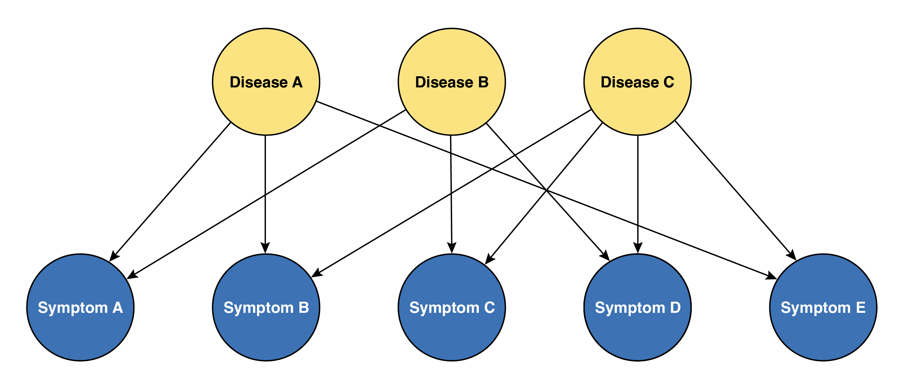
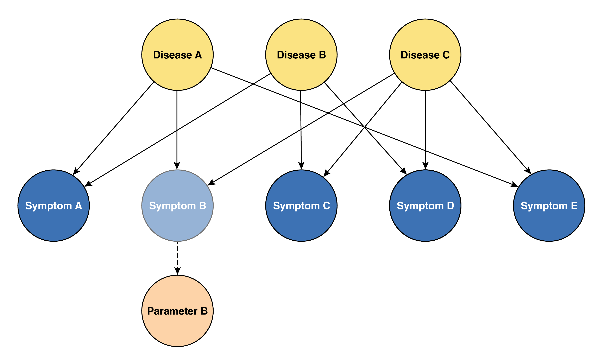
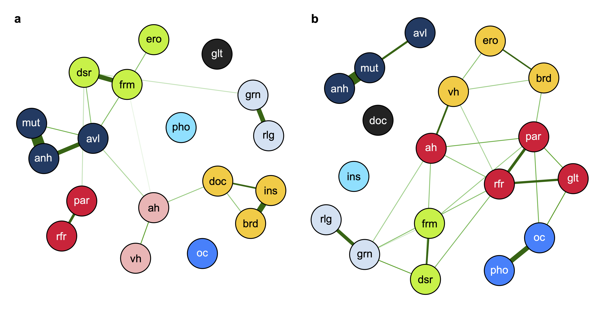

Over the past two decades, neuroscience has made remarkable progress, driven by numerous methodological and theoretical advances—among which computational neuroscience stands out as a major contributor. Although the gap between neurosicence and clinical practice continues to widen, ongoing efforts under the banner of *Computational Psychiatry* aim to bridge this divide by translating neuroscientific insights into improved understanding and treatment of psychiatric disease.

Since 2016, I've been drawn to computational psychiatry as an attractive field, captivated by its potential to steer psychiatry toward a more scientific, objective clinical practice. I then went to medical school and pursued my clinical carreer to become a psychiatrist. While I remain a devoted advocate of computational psychiatry, one question continues to gnaw at me: will computational psychiatry actually help us forge better clinical practice for psychiatric disease? My current take is cautiously optimistic—but only if computational psychiatry pivots from its current preoccupations.

## The syndromic view of disease

One of the great lessons that I've learned through nine years of medical education and clinical practice—though it may seem somewhat obvious—is that no single symptom or sign can be unique to a certain disease. Rather, we diagnose based on patterns, order, duration, and severity of symptoms and signs, which we call the "course" or "history" of the clinical findings. Similarly, no objective findings, including any kind of blood test or imaging, can be both sufficient and essential for diagnosing a single disease. We combine all clinical findings to form a clinical impression. In other words, medical diagnosis essentially embraces a philosophy of viewing disease as a *syndrome of clinical findings*. Symptoms are therefore the *aliased observations* of the disease, and the clinician's role is to infer the *latent state* of the patient—the procedure we call diagnosis.

Progress made in recent medicine has unraveled the underlying mechanisms of many diseases, which has also affected diagnostic criteria to reflect the known pathophysiology. A good example would be chronic myeloid leukemia (CML). Back in the 1950s, CML was known as chronic granulocytic leukemia (CGL), with diagnosis based on hematologic morphology in blood and bone marrow, accompanied by characteristic clinical manifestations such as splenomegaly and chronic progression. The discovery of the Philadelphia chromosome and its associated BCR-ABL1 fusion gene, however, led to a dramatic change in diagnostic criteria. Today, the presence of BCR-ABL1 is the definitive diagnostic hallmark, detectable even in rare cases of "aleukemic" CML where patients harbor the fusion gene despite normal blood counts—cases that would have been entirely missed by the morphology-based criteria of the 1950s. Moreover, understanding this molecular mechanism enabled the development of tyrosine kinase inhibitors like imatinib, which specifically target the BCR-ABL1 protein and have dramatically improved patient outcomes.

However, many other diseases still remain with unknown pathophysiology. One example is multiple sclerosis (MS). While we know the disease involves demyelination, the actual cause and pathophysiology remain unclear. Diagnosis relies on McDonald criteria, combining clinical episodes, MRI lesion patterns, and CSF findings—essentially pattern recognition across time and space. Similarly, diseases with unknown mechanisms (or those where mechanisms are known but lack reliable biomarkers) continue to depend on syndromic approaches for diagnosis. More fundamentally, this syndromic approach applies to all diseases—even those like CML now have mechanism-based markers, but still rely on recognizing patterns, albeit with fewer variables to consider.

## Computational psychiatry is still 'symptomology'
While you've been reading through the preceding discussion, you might have been thinking, "Okay, I get it. Diagnosis is difficult. But what does this have to do with computational psychiatry?" The connection becomes clear when we examine what computational psychiatry is actually doing: despite its ambitious pursuit of sophisticated mathematical models and promising rhetoric about mechanistic understanding, it remains fundamentally rooted in the same symptom-based approach that has defined psychiatry for decades. In essence, computational psychiatry is still doing 'symptomology'—but just with more elegant equations.

This limitation originates from experimental design. Most computational models fit behavioral and perceptual data based on task responses, essentially objectifying behavioral phenomena that are already defined. While this quantification feels like progress—replacing subjective clinical impressions with mathematical precision (and yes, I admit this is also progress, though it's a bit like upgrading from "quite sad" to "depression severity score: 7.3"!)—it's fundamentally still measuring the same thing: symptoms and signs, not underlying pathophysiology.

Consider the elegant work by [Powers *et al.*](https://www.science.org/doi/10.1126/science.aan3458) showing that Pavlovian conditioning-induced hallucinations and computational modeling can distinguish voice hearers classified as psychotic, with those cliam to be voice hearers but not psychotic, by different set of parameters out of normal range resembling each group. Such findings can indeed provide useful insights into the computational mechanisms underlying specific symptoms. However, we must recognize that providing useful insights is an essential condition, not a sufficient condition, for a model to offer true mechanistic explanation of disease. There's a crucial distinction between **explainability of symptoms** and **explainability of disease**—and computational psychiatry, despite its mathematical sophistication, remains firmly planted in the former territory.

Making it worse, having parameters with diagnostic value might be encouraging, but this doesn't necessarily lead to simpler or more fundamental diagnostic criteria. Consider rheumatoid arthritis: despite our ability to measure inflammatory markers and antibodies with precision, the diagnosis still relies on clinical criteria that now combine even more factors than before—a nightmare for any med-school student trying to memorize them all. Similarly, computational psychiatry may give us better ways to measure what we've always been measuring, but it hasn't fundamentally changed what we're looking for.

## Psychiatric disease follows the same syndromic logic
As a reminder, psychiatric disease is also disease, so it operates under the same diagnostic constraints and syndromic framework as other medical conditions. The fact that we're dealing with behavior and cognition rather than blood counts or joint inflammation doesn't exempt psychiatry from the fundamental limitations of medical diagnosis. The absence of clear biomarkers makes psychiatric diagnosis even more dependent on pattern recognition across multiple domains—symptoms, course, severity, and functional impact.

Just as no single laboratory value defines rheumatoid arthritis or inflammatory bowel disease, no single psychotic symptom is unique to either bipolar disorder with psychotic features or schizophrenia. As I discussed in my [recent paper](https://www.nature.com/articles/s41398-025-03403-6), the diagnostic distinction between these conditions relies on recognizing distinctive lifelong symptom patterns—schizophenia characterized by negative symptoms as its core feature, while bipolar I disorder centers around positive symptoms. However, this pattern recognition remains limited to the population level and cannot reliably be applied to individual patients. We're still fundamentally in the business of syndrome recognition, whether we're looking at white blood cell differentials or thought disorder patterns. The computational sophistication therefore doesn't change the underlying diagnostic philosophy.

## Requirements for 'mechanstic' computational psychiatry
If computational psychiatry is to transcend its current symptom-focused limitations and achieve true mechanistic understanding, it must meet several fundamental requirements that go far beyond elegant curve-fitting to behavioral data.

First, models must demonstrate unique mapping to similar but distinct pathophysiological processes. Just as hypertrophic and dilated cardiomyopathy share the common endpoint of heart failure but require different treatments based on their distinct underlying mechanisms, computational models should distinguish between psychiatric conditions that may appear phenomenologically similar but arise from different biological processes. Current models often fail to test at this level of granularity—they mostly distinguish between psychiatric diseases that are already easily distinguished by trained clinicians—raising questions about their utility in clinical application.

Second, truly mechanistic models must explain both normal individuals and psychiatric disease within the same framework through different parameter ranges, not separate models entirely. This reflects the dimensional nature of psychiatric symptoms and provides a crucial test of biological validity. More critically, if these parameters truly represent causal mechanisms, then controlling them should lead to predictable changes in symptom severity—avoiding the scenario where the true mechanism serves as a confounder of both the parameter and symptom severity.

Finally, models must maintain biological plausibility even at the neural representation level. A model might perfectly predict behavioral outcomes while proposing mechanisms that violate or neglect basic neurobiology. Without this constraint, we risk creating sophisticated mathematical descriptions that, while predictively useful, tell us nothing about the actual biological processes underlying psychiatric disease. The goal isn't just to explain the surface phenomena (behavior)—it's to understand and ultimately intervene at the level of mechanism.

## The broader critique of symptom-based psychiatry
This symptom-focused limitation isn't unique to computational psychiatry. It reflects a broader criticism of modern psychiatric practice itself. The DSM-5 faced criticism for diagnostic criteria that largely ignore recent neuroscientific findings and for removing the multiaxial system, which compressed individual characteristics into oversimplified categorical formats rather than preserving the multidimensional nature of mental health. These criticisms highlight psychiatry's continued reliance on syndromic approaches even as our understanding of brain function has advanced dramatically.

I should admit. Computational psychiatry does offer genuine value in objectifying subjective symptoms and has enormous potential to impact clinical practice. The mathematical precision it brings to measuring psychological phenomena represents real progress over purely subjective clinical impressions. However, if we expect current computational psychiatry to unravel the underlying mechanisms of psychiatric disease, we are likely to be disappointed. The field's current trajectory—focused on explaining and quantifying existing symptom categories—will not fundamentally transform our understanding of psychiatric disease.

The path forward requires computational psychiatry to shift from its current explanatory approach toward a genuinely mechanistic one. Only by meeting the requirements of unique pathophysiological mapping, dimensional modeling across normal and pathological states, and biological plausability, computational approaches can hope to move psychiatry beyond its syndromic constraints. Until then, we remain in the familiar territory of measruing symptoms with greater precision—valuable, but not revolutionary.

## References

1. [Huys, Q. J., Maia, T. V., & Frank, M. J. (2016). Computational psychiatry as a bridge from neuroscience to clinical applications. _Nature neuroscience_, _19_(3), 404-413.](https://www.nature.com/articles/nn.4238)
1. [Karanas, A., & Silver, R. T. (1968). Characteristics of the terminal phase of chronic granulocytic leukemia. _Blood_, _32_(3), 445-459.](https://www.sciencedirect.com/science/article/pii/S0006497120779620)
1. [Dugue, A. (2025). The 2024 Revised McDonald Criteria: AAN 2025 Highlights. _Neurology_.](https://www.emjreviews.com/neurology/congress-review/the-2024-revised-mcdonald-criteria-aan-2025-highlights-j310125/)
1. [Powers, A. R., Mathys, C., & Corlett, P. R. (2017). Pavlovian conditioning–induced hallucinations result from overweighting of perceptual priors. _Science_, _357_(6351), 596-600.](https://www.science.org/doi/10.1126/science.aan3458)
1. [Vaghi, M. M., Luyckx, F., Sule, A., Fineberg, N. A., Robbins, T. W., & De Martino, B. (2017). Compulsivity reveals a novel dissociation between action and confidence. _Neuron_, _96_(2), 348-354.](https://www.sciencedirect.com/science/article/pii/S0896627317308413)
1. [Kim, Y. H., *et al*. (2025). Revealing differential psychotic symptoms in schizophrenia and bipolar I disorder by manifold learning and network analyses. _Translational Psychiatry_, _15_(1), 194.](https://www.nature.com/articles/s41398-025-03403-6)
1. [Abuse, S., & Administration, M. H. S. (2016). DSM-5 Changes: Implications for Child Serious Emotional Disturbance.](https://pubmed.ncbi.nlm.nih.gov/30199184/)
1. [Casey, B. J., Craddock, N., Cuthbert, B. N., Hyman, S. E., Lee, F. S., & Ressler, K. J. (2013). DSM-5 and RDoC: progress in psychiatry research?. _Nature Reviews Neuroscience_, _14_(11), 810-814.](https://www.nature.com/articles/nrn3621)
1. [Wakefield, J. C. (2016). Diagnostic issues and controversies in DSM-5: return of the false positives problem. _Annual review of clinical psychology_, _12_(1), 105-132.](https://pubmed.ncbi.nlm.nih.gov/26772207/)
